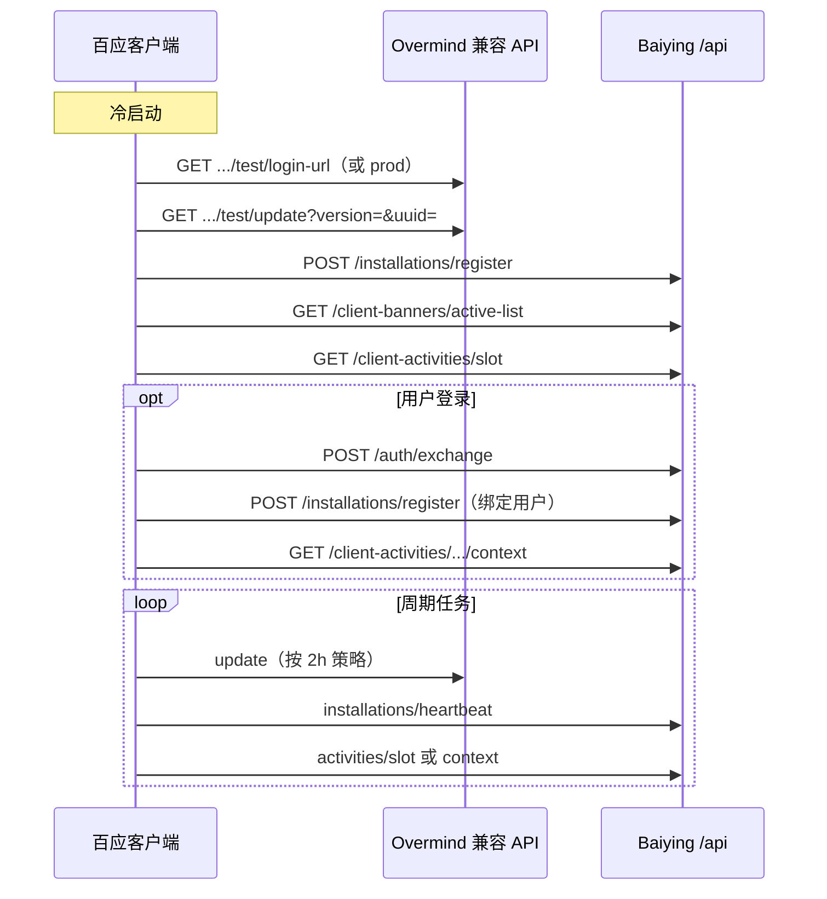

# 10. 百应客户端对接指南

本文档面向 **百应桌面客户端（NEXUS）** 开发者，说明如何对接当前 Baiying Server **已实现** 的全部客户端 HTTP 接口，涵盖本地开发、测试与生产环境。

> **权威来源**
> - 字段级契约：`docs/03-api-contracts.md`
> - 机器可读定义：`openapi/implemented.yaml`（Swagger：`/docs`）
> - 本文侧重：环境配置、调用时序、鉴权策略、缓存与验收

---

## 10.1 当前实现范围

### 已实现（客户端应接入）

| 模块 | 接口前缀 / 路径 | 说明 |
| --- | --- | --- |
| Overmind 兼容 | `/openapi/get/luna/hardware/baiying/{env}/{key}` | 市场目录、更新、登录页 URL |
| 鉴权 | `/api/auth/exchange`、`/refresh`、`/logout` | Portal 授权码交换与 Token 生命周期 |
| 开发联调 | `/api/auth/dev/test-login` | **仅非生产**；模拟 Portal 回调 |
| Banner | `/api/client-banners/active-list`、`/active` | 侧边栏活动图 |
| 活动 | `/api/client-activities/slot`、`/context`、`/actions` | 签到与一次性积分 |
| 安装设备 | `/api/client/installations/register`、`/heartbeat` | 设备注册与在线状态 |
| 实时（可选） | `/api/realtime/capabilities`、`/events`、`/ack`、`/stream` | SSE / 轮询失效通知 |

### 当前未实现（勿依赖）

以下路径在 `openapi/openapi.yaml` 基线中存在，但 **本仓库 HTTP 层已移除**。客户端若仍调用会 404：

- `/api/user/profile`、`/api/user/quota`、`/api/user/profile-summary`
- `/api/models/**`

**影响与替代：**

- 登录后用户信息、额度摘要：使用 `POST /api/auth/exchange` 响应中的 `user` 与 `quota`。
- 活动领奖后刷新额度：当前无独立 quota 接口；可依赖 action 响应中的 `context`，或等待后续版本恢复 `/api/user/quota`。
- 实时 `recoveryPaths` 中若包含上述路径，客户端应降级为已实现的接口（如 activity context）。

---

## 10.2 环境与 Base URL

百应客户端通过环境变量（或内置配置）指向两类 Base URL：

| 变量 | 用途 |
| --- | --- |
| `BAIYING_SERVER_BASE_URL` | `/api/**` 直连业务接口 |
| `BAIYING_OVERMIND_BASE_URL` | Overmind 兼容路径 |
| `BAIYING_PORTAL_BASE_URL` | Portal 登录页（也可由 Overmind `login-url` 下发） |

### 10.2.1 三套环境对照

| 场景 | 服务端 `NODE_ENV` | Overmind 路径 `{env}` | 直连 API 数据（Banner/活动/安装） | 典型 Base URL |
| --- | --- | --- | --- | --- |
| **本地开发** | `development` | `test`（推荐） | `test` | `http://127.0.0.1:8899` |
| **测试 / Staging** | `test` | `test` | `test` | `https://baiying-server-test.example.com` |
| **生产** | `production` | `prod` | `prod` | `https://baiying-server.example.com` |

**重要区别：**

1. **Overmind 接口**：客户端在 URL 中显式传 `{environment}` = `test` 或 `prod`，同一服务可同时承载两套发布数据。
2. **直连 API**（Banner、活动、安装设备）：数据环境由 **服务端进程** 决定——`NODE_ENV=production` 读 `prod`，否则读 `test`。客户端 **不能** 用查询参数切换。
3. 测试客户端连生产 Overmind（`/prod/`）但连测试 API 服务（`NODE_ENV=test`）时，市场/更新与 Banner/活动可能不一致；联调时应保证 **Base URL 与 `{env}` 配套**。

### 10.2.2 推荐配置示例

**本地（`.env` 或客户端 config）：**

```env
BAIYING_SERVER_BASE_URL=http://127.0.0.1:8899
BAIYING_OVERMIND_BASE_URL=http://127.0.0.1:8899
BAIYING_PORTAL_BASE_URL=http://127.0.0.1:8899
# Overmind 请求使用 /openapi/.../baiying/test/...
```

**测试：**

```env
BAIYING_SERVER_BASE_URL=https://baiying-server-test.example.com
BAIYING_OVERMIND_BASE_URL=https://api-overmind-test.example.com
# 或同一 host：.../openapi/.../baiying/test/...
```

**生产：**

```env
BAIYING_SERVER_BASE_URL=https://baiying-server.example.com
BAIYING_OVERMIND_BASE_URL=https://api-overmind.example.com
# Overmind 请求使用 .../baiying/prod/...
```

### 10.2.3 本地启动（供联调）

```bash
docker compose up -d postgres minio minio-init
npm ci
npm run db:migrate
npm run db:seed
npm run dev
```

- API：`http://127.0.0.1:8899`
- Swagger：`http://127.0.0.1:8899/docs`
- 管理台：`http://127.0.0.1:8899/admin`（运营用，非客户端）

---

## 10.3 通用约定

### 10.3.1 响应信封

所有 JSON 业务接口（SSE 除外）：

```ts
interface ApiEnvelope<T> {
  code: number;      // 0 = 成功
  message?: string;
  data: T;
}
```

- HTTP 状态码表达传输/鉴权（401、409、429 等）。
- `code` 表达稳定业务原因（如 `51104` 已领取）。

### 10.3.2 请求头

```http
Content-Type: application/json        # POST 有 body 时
Accept: application/json
Authorization: Bearer <access-token> # 按需
User-Agent: BaiyingDesktop/<version> # 建议
```

### 10.3.3 归因参数

以下查询参数或 JSON 字段为 **可选**，缺失不得拒绝请求：

| 字段 | 说明 |
| --- | --- |
| `uuid` | 客户端安装 UUID（应与 `installationId` 一致，见 §10.9） |
| `userId` | 已登录用户标识 |
| `version` | 客户端版本，如 `2026.8.21` |
| `firstKeyfrom` / `latestKeyfrom` | 来源归因 |

### 10.3.4 鉴权与 Token 刷新

| 模式 | 行为 |
| --- | --- |
| **公开** | 不带 Token |
| **可选鉴权** | 有 Token 则识别用户；**无效 Token 降级为匿名**（不返回 401） |
| **必须鉴权** | 无 Token 或无效 Token → HTTP 401 + `40100` |

**401 处理（必须鉴权接口）：**

1. 使用 Refresh Token 调用 `POST /api/auth/refresh`。
2. 成功则用新 Access Token **重试原请求一次**。
3. Refresh 永久失败（401）→ 清空本地登录态，引导重新登录。
4. Refresh 返回 5xx → **不要** 清空登录态，稍后重试。

**可选鉴权接口**（slot、context、installations）：无效 Token 当匿名，**不要** 触发 refresh。

### 10.3.5 缓存与 ETag

| 接口类型 | Cache-Control | 客户端建议 |
| --- | --- | --- |
| 市场 catalog（Overmind kit/skill/mcp） | `public, max-age=60, stale-while-revalidate=300` | 带 `If-None-Match`；304 用本地缓存 |
| Banner 列表 | 同上 | 同上 |
| 更新 check（Overmind update） | `private, no-store` | 不共享缓存；每次个性化灰度 |
| 活动 / 安装 / 鉴权 | 通常 `no-store` | 不依赖 HTTP 缓存 |

响应头：

- 市场：`ETag`、`X-Catalog-Revision`
- 更新：`X-Update-Release`（有发布时）

---

## 10.4 接口总览

| # | 方法 | 路径 | 鉴权 | 测试 `{env}` | 生产 `{env}` |
| --- | --- | --- | --- | --- | --- |
| 1 | GET | `/openapi/.../baiying/{env}/login-url` | 公开 | test | prod |
| 2 | GET | `/openapi/.../baiying/{env}/kit-store` | 公开 | test | prod |
| 3 | GET | `/openapi/.../baiying/{env}/skill-store` | 公开 | test | prod |
| 4 | GET | `/openapi/.../baiying/{env}/mcp-marketplace` | 公开 | test | prod |
| 5 | GET | `/openapi/.../baiying/{env}/update` | 公开 | test | prod |
| 6 | GET | `/openapi/.../baiying/{env}/update-manual` | 公开 | test | prod |
| 7 | POST | `/api/auth/exchange` | 公开（限流） | 同左 | 同左 |
| 8 | POST | `/api/auth/refresh` | 公开（限流） | 同左 | 同左 |
| 9 | POST | `/api/auth/logout` | Bearer | 同左 | 同左 |
| 10 | POST | `/api/auth/dev/test-login` | 公开 | **仅非 production** | **不可用** |
| 11 | GET | `/api/client-banners/active-list` | 公开 | 服务端 test 数据 | 服务端 prod 数据 |
| 12 | GET | `/api/client-banners/active` | 公开 | 同上 | 同上 |
| 13 | GET | `/api/client-activities/slot` | 可选 | 同上 | 同上 |
| 14 | GET | `/api/client-activities/{code}/context` | 可选 | 同上 | 同上 |
| 15 | POST | `/api/client-activities/{code}/actions/{id}` | **必须** | 同上 | 同上 |
| 16 | POST | `/api/client/installations/register` | 可选 | 同上 | 同上 |
| 17 | POST | `/api/client/installations/heartbeat` | 可选 | 同上 | 同上 |
| 18 | GET | `/api/realtime/capabilities` | 公开 | 同左 | 同左 |
| 19 | GET | `/api/realtime/events` | Bearer | 同左 | 同左 |
| 20 | POST | `/api/realtime/ack` | Bearer | 同左 | 同左 |
| 21 | GET | `/api/realtime/stream` | Bearer（SSE） | 同左 | 同左 |

---

## 10.5 登录与 Token

### 10.5.1 生产流程（Portal）

1. 从 Overmind 获取登录页：`GET .../baiying/{env}/login-url` → `data.value` 为 Portal URL。
2. 系统浏览器打开 Portal，附加参数：
   - `source=electron`
   - `redirect_uri=http://127.0.0.1:<port>/auth/callback` 或 `baiying://auth/callback`
   - `state=<random>`
   - `electronLogin=success`（完成页）
3. Portal 回调带一次性 `code` 与 `state`。
4. 客户端校验 `state` 后调用 exchange。

**POST `/api/auth/exchange`**

```json
{
  "authCode": "one-time-code",
  "firstKeyfrom": "direct",
  "latestKeyfrom": "direct",
  "uuid": "50000000-0000-4000-8000-000000000001",
  "version": "2026.8.21"
}
```

成功 `data`：

```json
{
  "accessToken": "<jwt>",
  "refreshToken": "<opaque>",
  "user": {
    "yid": "10001",
    "nickname": "百应用户",
    "avatarUrl": null,
    "userId": "10001",
    "accountMode": "personal"
  },
  "quota": {
    "planName": "免费",
    "subscriptionStatus": "free",
    "creditsLimit": 1000,
    "creditsUsed": 0,
    "creditsRemaining": 1000,
    "hasPaidCredits": false,
    "mediaGenerationEntitled": false,
    "shareEntitled": false,
    "deploymentEntitled": false,
    "accountMode": "personal"
  }
}
```

| code | 含义 |
| --- | --- |
| 40000 | 请求格式错误 |
| 40100 | 授权码无效 |
| 40101 | 授权码过期或已使用 |
| 42900 | 过于频繁 |

**POST `/api/auth/refresh`**

```json
{
  "refreshToken": "<opaque>",
  "uuid": "50000000-0000-4000-8000-000000000001",
  "version": "2026.8.21"
}
```

成功返回新的 `accessToken` 与 `refreshToken`（**必须** 持久化替换旧 Refresh Token）。

**POST `/api/auth/logout`**

- Header：`Authorization: Bearer <accessToken>`
- Body：可为空 `{}` 或仅含归因字段
- 撤销当前 Token 家族；幂等成功

### 10.5.2 本地 / 测试快捷登录

**POST `/api/auth/dev/test-login`**（`NODE_ENV !== production`）

请求：

```json
{
  "redirectUri": "http://127.0.0.1:54321/auth/callback",
  "state": "dev-state-123",
  "codeChallenge": "<optional-pkce>",
  "codeChallengeMethod": "S256"
}
```

响应 `data.redirectTo` 为带 `code` 的完整回调 URL；客户端像 Portal 一样解析后走 `exchange`。

---

## 10.6 Overmind 兼容接口

**Base：** `{BAIYING_OVERMIND_BASE_URL}/openapi/get/luna/hardware/baiying/{environment}/{key}`

`{environment}`：`test` | `prod`

### 10.6.1 支持的 key

| key | 用途 | value 类型 |
| --- | --- | --- |
| `login-url` | Portal 登录地址 | string |
| `kit-store` | 专家套件市场 | object |
| `skill-store` | 技能市场 | object |
| `mcp-marketplace` | MCP/连接器市场 | object |
| `update` | 自动更新（stable 渠道） | object |
| `update-manual` | 手动更新（manual 渠道） | object |

通用响应：

```json
{
  "code": 0,
  "message": "success",
  "data": {
    "value": { }
  }
}
```

### 10.6.2 市场目录（kit / skill / mcp）

- **测试：** `GET .../baiying/test/kit-store`（skill、mcp 同理）
- **生产：** `GET .../baiying/prod/kit-store`

可选查询：`uuid`、`userId`、`version`、`firstKeyfrom`、`latestKeyfrom`

**客户端处理：**

- 解析 `data.value` 为 JSON 对象（MCP 历史兼容 string 时需 `JSON.parse`）。
- 保存 `ETag`；下次请求带 `If-None-Match`，304 则跳过解析。
- ZIP / 资源 URL 必须 HTTPS；下载后校验（若服务端未来下发 sha256）。

详见 `docs/03-api-contracts.md` §3.5–3.7 的 payload 示例。

### 10.6.3 更新检查（update / update-manual）

- **自动：** `GET .../baiying/{env}/update?uuid=...&version=2026.8.21&userId=...`
- **手动：** `GET .../baiying/{env}/update-manual?...`（参数相同）

有更新时 `data.value` 示例：

```json
{
  "version": "2026.8.22",
  "date": "2026-08-22",
  "changeLog": {
    "ch": { "title": "更新内容", "content": ["…"] },
    "en": { "title": "What's new", "content": ["…"] }
  },
  "windowsX64": { "url": "https://downloads.example.com/.../Setup.exe" },
  "macIntel": { "url": "https://.../x64.dmg" },
  "macArm": { "url": "https://.../arm64.dmg" }
}
```

**无更新：** `data.value = {}`（仍为 `code: 0`）。

**客户端规则：**

- 仅当 `value.version` **高于** 本地版本时提示更新（三段/四段数字逐段比较）。
- `update` = stable；`update-manual` = manual，灰度规则可不同。
- 不要用 CDN/代理缓存该响应（`private, no-store`）。
- Windows URL 以 `.exe` 结尾；macOS 以 `.dmg` 结尾；必须 HTTPS。

**推荐频率（与现有客户端一致）：**

- 启动后检查一次；
- 后台每 30 分钟唤醒，距上次检查 ≥ 2 小时再请求；
- 窗口从隐藏变为可见时补查。

---

## 10.7 Banner

### GET `/api/client-banners/active-list`

查询参数：

| 参数 | 必填 | 说明 |
| --- | --- | --- |
| `placement` | 是 | 固定 `desktop_sidebar` |
| `uuid`、`userId`、`version`、`firstKeyfrom`、`latestKeyfrom` | 否 | 归因 |

**测试 vs 生产：** 由 API 服务 `NODE_ENV` 决定读 test/prod 发布，**与 Overmind `{env}` 无自动关联**。

响应 `data` 为数组；空则 `[]`。支持 ETag / 304。

### GET `/api/client-banners/active`

兼容旧客户端：返回排序后 **第一条** 或 `null`。

**客户端建议：**

- 侧边栏挂载时拉取；可用 `id + updatedAt` 决定是否重新展示。
- 登录状态 **不应** 改变结果。

---

## 10.8 活动

### GET `/api/client-activities/slot`

| 参数 | 示例 |
| --- | --- |
| `placement` | `desktop_sidebar`（每日签到）或 `desktop_startup_modal`（启动弹窗） |
| `clientVersion` | `2026.8.21` |
| `containerApiVersion` | 侧边栏 `2`，启动弹窗 `3` |
| `platform` | `win32` / `darwin` / `linux` |

鉴权：**可选**（有效 Token 识别用户；无效 Token → 匿名）。

`slotState`：`empty` | `available`；含 `activity` 时带 `activityCode`、`configRevision`、`templateKey` 等。

### GET `/api/client-activities/{activityCode}/context`

查询：`configRevision=<int>`

鉴权：可选。匿名时不泄漏用户进度。

`lifecycleState`：`active` | `not_started` | `ended` | `offline` | `superseded`

### POST `/api/client-activities/{activityCode}/actions/{actionId}`

鉴权：**必须** Bearer。

Body：

```json
{
  "configRevision": 3,
  "idempotencyKey": "daily-check-in-<uuid>",
  "payload": {}
}
```

- 每日签到：`actionId = check_in`
- 一次性奖励：`actionId = claim`

成功含 `replayed`、`result`、`context`（完整新状态）。

| code | 含义 |
| --- | --- |
| 51100 | 活动不存在 |
| 51101 | 未开始/已结束/下线/预算不足 |
| 51102 | 需要登录 |
| 51103 | 动作不允许 |
| 51104 | 已领取 |
| 51105 | 配置无效 |
| 51106 | configRevision 过期 → 重新拉 slot/context |

**推荐刷新：**

- 侧边栏签到：约 30 分钟 + 跨日边界
- 启动弹窗活动：最长 24 小时 + 窗口变化

---

## 10.9 安装设备

详见字段：`docs/03-api-contracts.md` §3.14。

### 接口

| 方法 | 路径 | 鉴权 |
| --- | --- | --- |
| POST | `/api/client/installations/register` | 可选 |
| POST | `/api/client/installations/heartbeat` | 可选 |

### 核心规则

- `installationId` = 本地持久化 UUID = 登录 `uuid`。
- 未登录可 register/heartbeat → **匿名设备**。
- 登录后 register/heartbeat → **绑定用户**。
- heartbeat 间隔建议 **60–120 秒**（离线阈值默认 300 秒）。

### register 示例

```json
{
  "installationId": "50000000-0000-4000-8000-000000000001",
  "hostname": "DESKTOP-01",
  "platform": "win32",
  "osVersion": "Windows 11 26100",
  "appVersion": "2026.8.21",
  "macAddress": "AA-BB-CC-DD-EE-FF"
}
```

失败不阻断主流程；日志勿打印 Token。

---

## 10.10 实时事件（可选）

旧客户端可完全忽略。启用前先调 capabilities。

### GET `/api/realtime/capabilities`（公开）

检查 `data.enabled`、`protocolVersions`、`transports`。

### GET `/api/realtime/events`（Bearer）

| 参数 | 说明 |
| --- | --- |
| `protocolVersion` | 固定 `1` |
| `consumerId` | 稳定 UUID（每安装/消费实例一个） |
| `afterCursor` | 可选，BIGINT 字符串 |
| `limit` | 可选 |

`cursor` **不得** 转为 JS number。`resyncRequired=true` 时按 `recoveryPaths` 全量 HTTP 刷新。

### POST `/api/realtime/ack`（Bearer）

```json
{
  "protocolVersion": 1,
  "consumerId": "<uuid>",
  "cursor": "42"
}
```

### GET `/api/realtime/stream`（Bearer，SSE）

- 必须 Header 传 Token，**禁止** URL 传 Token。
- 使用支持自定义 Header 的 fetch/stream 实现。
- 断线按 `retry` 与指数退避重连。

事件类型（失效提示，非完整状态）：

- 用户：`activity.reward.granted`、`credit.balance.changed`
- 广播：`activity.config.changed`、`catalog.config.changed`、`update.config.changed`、`banner.config.changed`

---

## 10.11 推荐集成时序



**登录成功后建议顺序：**

1. 持久化 Token
2. `installations/register`（绑定设备）
3. 刷新 activity context
4. （可选）连接 realtime

**退出登录：**

1. `POST /auth/logout`
2. 清除本地 Token
3. 停止带 Token 的 heartbeat；已绑定设备不要用匿名 heartbeat 更新

---

## 10.12 联调与验收

### 10.12.1 测试环境检查清单

- [ ] Overmind `test` 下 kit/skill/mcp 返回 seed 数据
- [ ] Overmind `test/update` 无发布时 `value={}`
- [ ] Banner 列表与 ETag/304
- [ ] 活动 slot 匿名/登录两种视图
- [ ] 签到 action 幂等与 51106 刷新
- [ ] 匿名 + 登录后安装设备绑定
- [ ] exchange / refresh / logout / 重放检测
- [ ] （可选）realtime 续传与 ACK

### 10.12.2 生产环境检查清单

- [ ] 全部 Overmind 请求使用 `prod`
- [ ] API 服务 `NODE_ENV=production`
- [ ] HTTPS、证书、`PUBLIC_BASE_URL` 正确
- [ ] **不存在** `/api/auth/dev/test-login`
- [ ] 更新包 URL 为真实签名 EXE/DMG
- [ ] Portal 为正式域名，非 localhost
- [ ] 限流与 429 退避

### 10.12.3 常用 curl（本地 test）

```bash
# 市场
curl -sS "http://127.0.0.1:8899/openapi/get/luna/hardware/baiying/test/kit-store"

# 更新
curl -sS "http://127.0.0.1:8899/openapi/get/luna/hardware/baiying/test/update?version=2026.8.21&uuid=50000000-0000-4000-8000-000000000001"

# Banner
curl -sS "http://127.0.0.1:8899/api/client-banners/active-list?placement=desktop_sidebar"

# 活动 slot
curl -sS "http://127.0.0.1:8899/api/client-activities/slot?placement=desktop_sidebar&clientVersion=2026.8.21&containerApiVersion=2&platform=win32"

# 匿名安装注册
curl -sS -X POST http://127.0.0.1:8899/api/client/installations/register \
  -H 'content-type: application/json' \
  -d '{"installationId":"50000000-0000-4000-8000-000000000001","hostname":"DEV","platform":"win32","osVersion":"Win11","appVersion":"2026.8.21"}'

# 开发登录 + exchange
curl -sS -X POST http://127.0.0.1:8899/api/auth/dev/test-login \
  -H 'content-type: application/json' \
  -d '{"redirectUri":"http://127.0.0.1:54321/cb","state":"s1"}'
```

---

## 10.13 错误码速查

| 模块 | code | 含义 |
| --- | --- | --- |
| 通用 | 0 | 成功 |
| 鉴权 | 40000 | 请求无效 |
| 鉴权 | 40100 / 40101 | 未授权 / 过期 |
| 鉴权 | 42900 | 限流 |
| 安装 | 40080 | 字段无效 |
| 安装 | 40480 | 未找到或匿名不可更新 |
| 安装 | 40980 | 已绑定其他账号 |
| 活动 | 51100–51106 | 见 §10.8 |
| 实时 | 40020 / 40920 / 42600 / 42920 / 50320 | cursor/协议/连接 |

完整列表见 `docs/03-api-contracts.md` 各节。

---

## 10.14 相关文档

| 文档 | 内容 |
| --- | --- |
| `docs/03-api-contracts.md` | 完整 HTTP 契约与 JSON 示例 |
| `docs/05-auth-and-security.md` | Token、限流、供应链安全 |
| `docs/06-testing-and-acceptance.md` | 测试矩阵与 staging 验收 |
| `openapi/implemented.yaml` | 当前已实现 OpenAPI |

**文档维护：** 接口变更须同步更新 `openapi/implemented.yaml`（`npm run openapi:generate`）与本指南。
